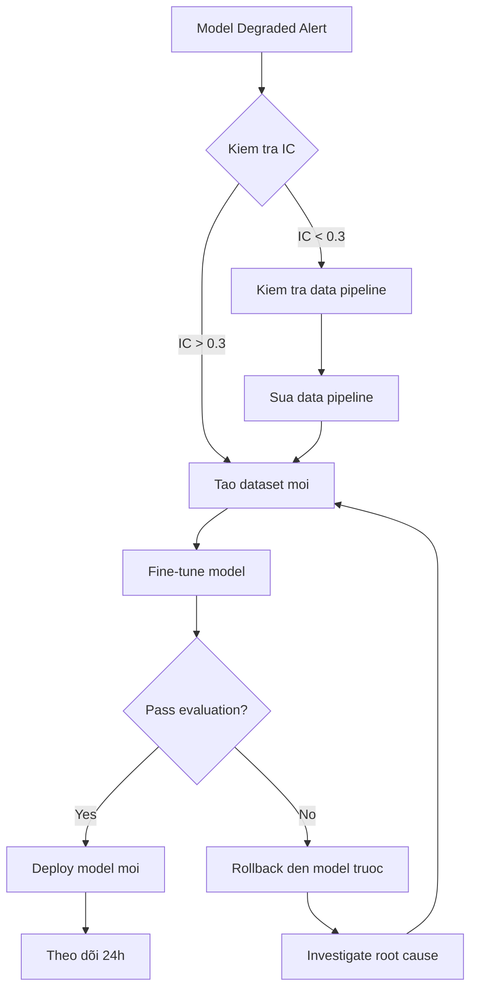
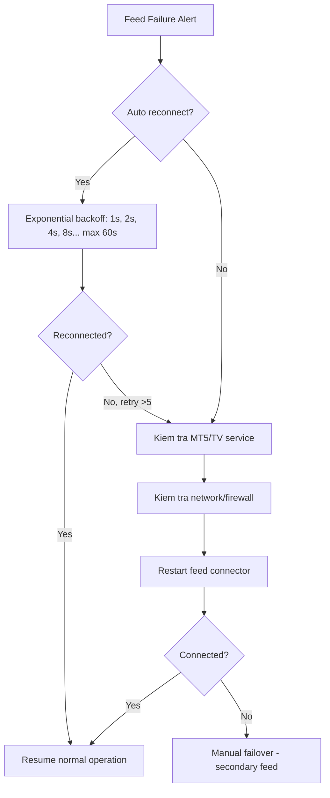
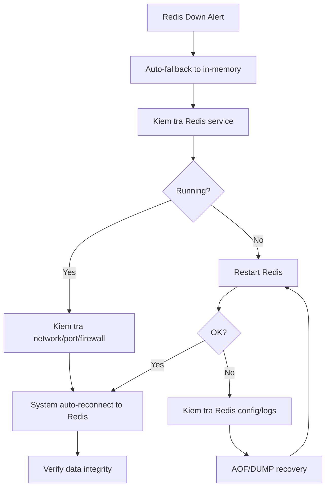
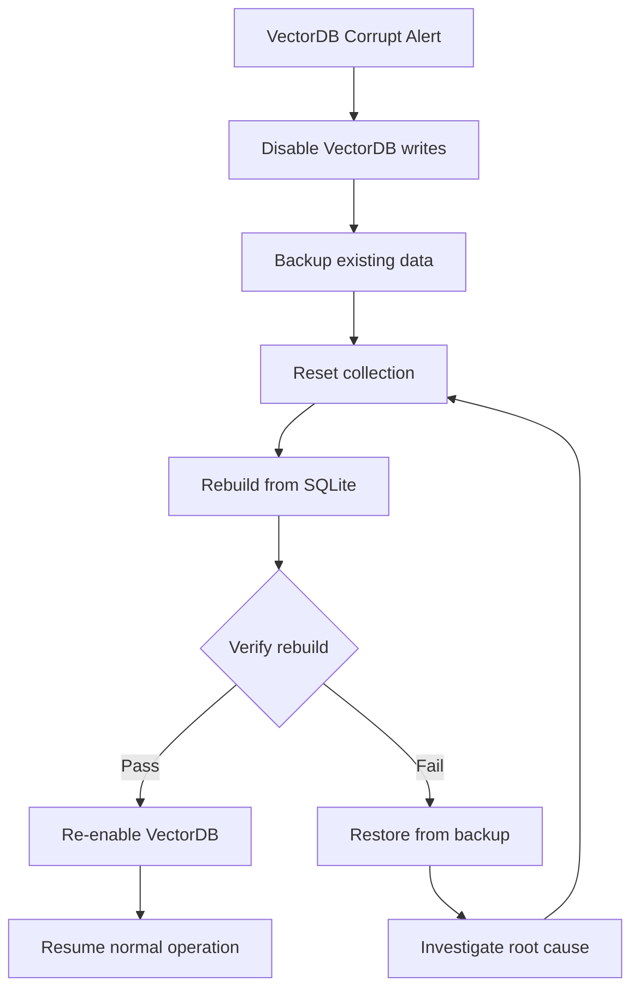

# Incident Response Runbook — AGENTIC-QUANT

> Hướng dẫn ứng phó sự co cho hệ thống AGENTIC-QUANT.

---

## Mục lục

1. [Model Degraded](#1-model-degraded)
2. [Feed Failure (MT5 / TV Webhook)](#2-feed-failure-mt5--tv-webhook)
3. [Redis Down](#3-redis-down)
4. [VectorDB Corrupt (Qdrant / ChromaDB)](#4-vectordb-corrupt-qdrant--chromadb)
5. [Thông tin chung](#5-thông-tin-chung)

---

## 1. Model Degraded

### Dấu hiệu

- Tỷ lệ thắng giảm >15% so với baseline (tracked trong Prometheus metric `trade_win_rate`)
- Sharpe ratio < 0.5
- Confidence score output thấp (< 0.4) kéo dài
- Alert từ dashboard hoặc log:
  ```
  [WARNING] Model performance degraded: win_rate=0.38 (baseline=0.55)
  ```

### Mức độ nghiêm trọng

| Mức   | Tiêu chí                              | Hành động                              |
|-------|---------------------------------------|----------------------------------------|
| P2    | Win rate giảm 5-10%, hồi phục trong 1h| Theo dõi, chưa can thiệp               |
| P1    | Win rate giảm 10-20%, kéo dài >2h     | Kiểm tra IC, cân nhắc fine-tune        |
| P0    | Win rate giảm >20%, hoặc stop loss     | Fine-tune ngay, disable trading signals |

### Quy trình xử lý



### Steps chi tiết

**Step 1: Kiểm tra Information Coefficient (IC)**

```bash
# IC measures predictive power: >0.3 = good, 0.1-0.3 = weak, <0.1 = random
python3 -m core.ml.diagnostics.check_ic --days 30

# Output:
#   IC: 0.22  (DEGRADED — was 0.41 last week)
#   Rank IC: 0.18
#   P-value: 0.002
```

**Step 2: Thu thập dataset mới**

```bash
# Fetch dữ liệu mới nhất từ MT5
python3 -m core.ml.pipeline.collect_training_data --days 60

# Build features
python3 -m core.ml.build_xgb_dataset
```

**Step 3: Fine-tune model**

```bash
# Fine-tune voi dataset mới
python3 -m core.ml.finetune --model-type lstm --epochs 20 --lr 0.0001
python3 -m core.ml.train_model_a
python3 -m core.ml.train_model_b

# Evaluate
python3 -m core.ml.evaluate_models
```

**Step 4: Deploy nếu pass evaluation**

```bash
# Nếu evaluation pass (win_rate >= baseline * 0.9)
python3 -m core.ml.deploy_model --model-path models/latest

# Restart inference service
curl -X POST http://127.0.0.1:9999/api/v1/admin/reload-model
```

**Step 5: Rollback nếu evaluation fail**

```bash
# Rollback den model gần nhất còn tốt
python3 -m core.ml.rollback --version previous

# Restart inference
curl -X POST http://127.0.0.1:9999/api/v1/admin/reload-model
```

### Check sau xử lý

```bash
# Verify performance
python3 -m core.ml.diagnostics.check_ic --days 7
python3 -m core.ml.diagnostics.report

# Check metrics
curl http://127.0.0.1:9999/metrics | grep trade_win_rate
```

---

## 2. Feed Failure (MT5 / TV Webhook)

### Dấu hiệu

- No ticks received in >30 seconds (Prometheus: `tick_age_seconds`)
- Webhook 4xx/5xx errors (log: `WEBHOOK_ERROR`)
- MT5 connection timeout (log: `[ERROR] MT5 connection lost`)
- Alert:
  ```
  [CRITICAL] No data feed for 60s — symbol=XAUUSD
  ```

### Mức độ

| Mức   | Thời gian gián đoạn | Hành động                             |
|-------|---------------------|----------------------------------------|
| P3    | <30s                | Auto reconnect, không cần intervene    |
| P2    | 30s-5ph             | Theo dõi, kiểm tra network             |
| P1    | 5-30ph              | Restart connector, kiểm tra MT5/TV     |
| P0    | >30ph               | Manual failover, page on-call engineer |

### Quy trình xử lý



### Auto-reconnect behavior

Hệ thống tự động thực hiện exponential backoff:

| Lần thử | Backoff | Hành động                              |
|----------|---------|----------------------------------------|
| 1        | 1s      | Reconnect                              |
| 2        | 2s      | Reconnect                              |
| 3        | 4s      | Reconnect                              |
| 4        | 8s      | Reconnect                              |
| 5        | 16s     | Reconnect + log WARNING                |
| 6        | 32s     | Reconnect + log WARNING                |
| 7        | 60s     | Reconnect + log ERROR                  |
| 8+       | 60s     | Reconnect + alert on-call              |

### Steps chi tiết

**Step 1: Kiểm tra trạng thái**

```bash
# Kiểm tra feed health
curl http://127.0.0.1:9999/api/v1/health/feed

# Kiểm tra last tick
python3 -m core.ingestion.check_feed --symbol XAUUSD
```

**Step 2: Kiểm tra network**

```bash
# Kiểm tra MT5
python3 test_mt5_connect.py

# Kiểm tra webhook server
curl -v http://127.0.0.1:9999/api/v1/webhook/tv/health

# Kiểm tra internet
ping -c 3 google.com
```

**Step 3: Restart feed connector**

```bash
# Restart MT5 connector
curl -X POST http://127.0.0.1:9999/api/v1/admin/restart/mt5

# Hoặc restart toàn bộ ingestion service
curl -X POST http://127.0.0.1:9999/api/v1/admin/restart/ingestion
```

**Step 4: Manual failover**

Nếu MT5 không kết nối được >30 phút:

```bash
# Switch sang secondary feed (nếu có)
python3 -m core.ingestion.switch_feed --feed secondary

# Hoặc enable simulation mode
python3 -m core.ingestion.enable_simulation --symbol XAUUSD
```

**Step 5: Xử lý TV Webhook issues**

```bash
# Kiểm tra webhook log
grep "WEBHOOK" logs/agentic-quant.log | tail -50

# Rate limit check
curl http://127.0.0.1:9999/api/v1/health/rate-limit

# Nếu bị rate limit, reset:
curl -X POST http://127.0.0.1:9999/api/v1/admin/reset-rate-limit
```

---

## 3. Redis Down

### Dấu hiệu

- Log: `[ERROR] redis.exceptions.ConnectionError: Error 111 connecting to 127.0.0.1:6379`
- Prometheus: `redis_up{instance="...", job="redis"} = 0`
- Alert: `[CRITICAL] Redis unreachable — using in-memory fallback`

### Tác động

| Chức năng                  | Ảnh hưởng                                            |
|----------------------------|------------------------------------------------------|
| Short-term memory          | Hoạt động với in-memory fallback (mất data khi restart) |
| Active zone registry       | Giảm hiệu năng, dùng dict fallback                   |
| Caching                    | Cache miss, tăng latency                              |
| Pub/sub (Zones, IPC)       | Chuyển sang ZMQ broadcast fallback                    |
| Session management         | Giới hạn — in-memory only                            |

### Quy trình xử lý



### Steps chi tiết

**Step 1: Xác nhận fallback đang hoạt động**

```bash
# Kiểm tra system health (should show fallback active)
curl http://127.0.0.1:9999/api/v1/health
# Expected: {"status":"degraded","redis":"fallback","memory":"in-memory"}

# Kiểm tra memory usage
python3 -m core.utils.diagnostics.memory_usage
```

**Step 2: Restart Redis**

```bash
# Linux (WSL)
sudo systemctl restart redis-server
# hoặc
sudo service redis-server restart
# hoặc
redis-server --daemonize yes

# macOS
brew services restart redis

# Windows
net start Redis
# hoặc mở Services.msc > Redis > Restart
```

**Step 3: Kiểm tra Redis config**

```bash
# Kiểm tra config file
cat /etc/redis/redis.conf | grep -E "^bind|^port|^requirepass|^protected-mode"

# Kiểm tra log
tail -50 /var/log/redis/redis-server.log

# Test kết nối
redis-cli ping
```

**Step 4: Data recovery**

```bash
# Kiểm tra AOF file
ls -la /var/lib/redis/appendonly.aof

# Kiểm tra RDB dump
ls -la /var/lib/redis/dump.rdb

# Nếu cần, repair AOF
redis-check-aof --fix /var/lib/redis/appendonly.aof
```

**Step 5: Verify hệ thống hồi phục**

```bash
# Sau khi Redis up, verify system đã auto-reconnect
curl http://127.0.0.1:9999/api/v1/health
# Expected: {"status":"ok","redis":"connected","memory":"redis"}

# Kiểm tra data consistency
python3 -m core.memory.short_term.verify_integrity
```

---

## 4. VectorDB Corrupt (Qdrant / ChromaDB)

### Dấu hiệu

- Log: `[ERROR] QdrantStorageError: Collection data corrupted`
- Log: `[ERROR] ChromaDB: segment fault during read`
- Search queries return empty/incorrect results
- Alert:
  ```
  [CRITICAL] VectorDB query failed — collection=debate_archive error=corrupted_segment
  ```

### Tác động

| Function               | Ảnh hưởng                                                |
|------------------------|-----------------------------------------------------------|
| RAG retrieval          | Không thể truy vấn lịch sử (mất context)                  |
| Debate archiver        | Không lưu debate mới                                      |
| Zone embeddings        | Không matching zone patterns                              |
| Long-term memory       | Giảm chất lượng — fallback sang SQLite search (kém hơn)   |

### Quy trình xử lý



### Steps chi tiết

**Step 1: Ngăn ghi thêm vào VectorDB**

```bash
# Disable VectorDB writes (switch to SQLite fallback)
curl -X POST http://127.0.0.1:9999/api/v1/admin/vectordb/disable-writes

# Verify fallback active
curl http://127.0.0.1:9999/api/v1/health/vectordb
# Expected: {"status":"degraded","mode":"fallback","backend":"sqlite"}
```

**Step 2: Backup data trước khi reset**

```bash
# Backup từ Qdrant
python3 -m core.memory.long_term.backup_vectordb \
  --output data/backups/vectordb_$(date +%Y%m%d_%H%M%S).json

# Backup từ SQLite (fallback — data sạch hơn)
cp data/memory/history.db data/backups/history_$(date +%Y%m%d_%H%M%S).db
```

**Step 3: Reset VectorDB collections**

```bash
# Qdrant: Xóa và tao lại collection
curl -X DELETE http://127.0.0.1:6333/collections/debate_archive
curl -X DELETE http://127.0.0.1:6333/collections/zone_embeddings

# Tao lai collections
curl -X PUT http://127.0.0.1:6333/collections/debate_archive \
  -H "Content-Type: application/json" \
  -d '{"vectors":{"size":768,"distance":"Cosine"}}'

curl -X PUT http://127.0.0.1:6333/collections/zone_embeddings \
  -H "Content-Type: application/json" \
  -d '{"vectors":{"size":768,"distance":"Cosine"}}'
```

**Step 4: Rebuild từ SQLite (fallback)**

```bash
# Rebuild vectordb từ SQLite history store
python3 -m core.memory.long_term.rebuild_from_sqlite \
  --sqlite-path data/memory/history.db \
  --batch-size 100

# Monitor progress
curl http://127.0.0.1:9999/api/v1/health/vectordb/rebuild
# Expected: {"status":"rebuilding","progress":"65%","total":1500}
```

**Step 5: Verify rebuild**

```bash
# Kiểm tra số lượng vectors
python3 -m core.memory.long_term.verify_collection \
  --collection debate_archive \
  --expected-count 1500

# Test search
python3 -m core.memory.long_term.test_search \
  --query "what was the last trade signal" \
  --top-k 5
```

**Step 6: Re-enable VectorDB**

```bash
# Kích hoạt lại VectorDB khi rebuild xong
curl -X POST http://127.0.0.1:9999/api/v1/admin/vectordb/enable

# Verify
curl http://127.0.0.1:9999/api/v1/health/vectordb
# Expected: {"status":"ok","mode":"primary","backend":"qdrant","collections":2}
```

### Phòng ngừa

```bash
# Schedule backup hàng ngày (crontab)
0 3 * * * cd /path/to/AGENTIC-QUANT && python3 -m core.memory.long_term.backup_vectordb --auto

# Monitor health
*/5 * * * * curl -f http://127.0.0.1:6333/healthz || echo "Qdrant DOWN" | mail -s "Qdrant alert" admin@example.com
```

---

## 5. Thông tin chung

### Liên hệ on-call

| Vai trò            | Tên              | Số điện thoại    | Slack              |
|--------------------|------------------|------------------|--------------------|
| DevOps             | Ops Team         | +84-xxx-xxx-xxx  | #ops-alerts        |
| ML Engineer        | ML Lead          | +84-xxx-xxx-xxx  | #ml-alerts         |
| Trading            | Trading Lead     | +84-xxx-xxx-xxx  | #trading-alerts    |

### Communication channels

- **Slack**: #incidents (P0/P1), #alerts (P2/P3)
- **Email**: alerts@agentic-quant.local
- **PagerDuty**: (nếu có)

### Post-incident checklist

- [ ] Root cause identified and documented
- [ ] Timeline of events logged
- [ ] Monitoring/alerting improved (nếu cần)
- [ ] Runbook updated with new findings
- [ ] Team notified in post-mortem meeting

### Metrics dashboard

Dashboard: `http://127.0.0.1:3000/d/agentic-quant/overview` (Grafana, nếu cấu hình)

Key metrics:
- `trade_win_rate` — Tỷ lệ thắng
- `tick_age_seconds` — Tuổi của tick cuối
- `redis_up` — Redis availability
- `vectordb_query_latency_ms` — VectorDB latency
- `model_inference_latency_ms` — Model inference time
- `webhook_requests_total` — Webhook throughput

---

> **Last updated**: 2024-05-27
> **Version**: 1.0
> **Owner**: AGENTIC-QUANT Ops Team
